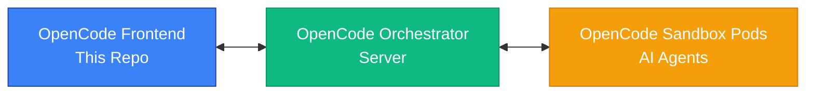

# OpenCode Frontend

> [!WARNING]  
> **WORK IN PROGRESS** - This project is currently under heavy development and is mostly vibe-coded with Claude Sonnet 4. Many features are mocked or incomplete. Use at your own risk and expect frequent changes!

## Overview

OpenCode Frontend is a modern web interface for the OpenCode AI development platform. It provides a comprehensive environment for AI-assisted software development with real-time collaboration between developers and AI agents.

This frontend is designed to work in conjunction with the [OpenCode server](https://github.com/denysvitali/opencode/tree/feature/server) to create isolated development environments where AI agents are spawned as Kubernetes pods (called "sandboxes") that can work directly on GitHub repositories.

## 🎯 Vision

OpenCode aims to provide a platform similar to [OpenHands](https://github.com/All-Hands-AI/OpenHands/) where:

- **AI agents work in isolated sandbox pods** - Each conversation session gets its own Kubernetes pod
- **Orchestrated by a central server** - The orchestrator manages sandbox lifecycle and routing
- **Direct GitHub integration** - Agents can clone, modify, and create pull requests on real repositories
- **Real-time collaboration** - Developers can observe and guide AI agents as they work
- **Full development environment** - Complete access to filesystem, terminal, git, and development tools

## ✨ Features

### Current Features
- **💬 Chat Interface** - Intuitive conversation UI with AI agents
- **📁 File Explorer** - Browse and preview files with syntax highlighting (Monaco Editor)
- **🔍 Git Diff Viewer** - Review changes made by AI agents
- **💻 Terminal Viewer** - Monitor command execution and outputs (read-only)
- **🔄 Session Management** - Multiple conversations with individual sandbox states
- **⚙️ Settings Panel** - Configure API endpoints and view version information
- **📱 Responsive Design** - Works on desktop and mobile devices

### Sandbox States
Each conversation shows real-time sandbox status:
- 🟢 **Connected** - Sandbox ready and responsive
- 🟡 **Connecting** - Sandbox starting up
- 🔴 **Error** - Sandbox encountered an issue
- ⚫ **Disconnected** - Sandbox offline

## 🏗️ Architecture



The system consists of three main components:

1. **OpenCode Frontend** (This repository) - Web interface for users
2. **OpenCode Orchestrator** - Central server that manages sandbox lifecycle
3. **OpenCode Sandbox Pods** - Individual Kubernetes pods where AI agents run

### How it works:
- **Frontend** communicates with the **Orchestrator** for all user interactions
- **Orchestrator** spawns and manages **Sandbox Pods** in Kubernetes
- Each conversation session gets its own isolated **Sandbox Pod**
- **Orchestrator** routes messages between Frontend and appropriate Sandbox
- **Sandbox Pods** contain the AI agents that actually work on code and repositories

### Component Structure
- **Layout Components** - Header, Sidebar, Navigation
- **Chat Components** - Message bubbles, conversation list
- **Development Tools** - File explorer, git diff, terminal
- **UI Components** - Settings dialog, modals, forms

## 🚀 Getting Started

### Prerequisites
- Node.js 18+ 
- npm or yarn
- Git

### Installation

1. **Clone the repository**
   ```bash
   git clone https://github.com/denysvitali/opencode-frontend.git
   cd opencode-frontend
   ```

2. **Install dependencies**
   ```bash
   npm install
   ```

3. **Start development server**
   ```bash
   npm run dev
   ```

4. **Open in browser**
   Navigate to `http://localhost:5173`

### Backend Setup

To use the full functionality, you'll need the OpenCode orchestrator and sandbox components:

1. **Clone the OpenCode repository**
   ```bash
   git clone https://github.com/denysvitali/opencode.git
   cd opencode
   git checkout feature/server
   ```

2. **Set up the orchestrator server** - Follow the setup instructions for the central orchestrator

3. **Configure Kubernetes** - Ensure you have a Kubernetes cluster where sandbox pods can be spawned

4. **Configure the frontend** to point to your orchestrator endpoint in Settings

## 🛠️ Development

### Tech Stack
- **React 18** - UI framework
- **TypeScript** - Type safety
- **Vite** - Build tool and dev server
- **Tailwind CSS** - Styling
- **Zustand** - State management
- **Monaco Editor** - Code editor
- **Lucide React** - Icons

### Build Information
The application automatically includes build metadata:
- **Version** - Latest git tag or "development"
- **Commit Hash** - Short commit hash (with `-dirty` suffix if uncommitted changes)
- **Build Date** - When the build was created

### Scripts
```bash
npm run dev          # Start development server
npm run build        # Build for production
npm run preview      # Preview production build
npm run lint         # Run ESLint
```

## 🤝 Contributing

This project is in active development. Contributions are welcome!

### Ways to Contribute
- 🐛 **Report bugs** - Open issues for any problems you encounter
- 💡 **Suggest features** - Share ideas for new functionality
- 🔧 **Submit pull requests** - Fix bugs or implement features
- 📖 **Improve documentation** - Help make the project more accessible

### Development Workflow
1. Fork the repository
2. Create a feature branch
3. Make your changes
4. Test thoroughly
5. Submit a pull request

## 📋 Roadmap

### Short Term
- [ ] Implement actual backend integration
- [ ] Add file editing capabilities
- [ ] Improve error handling and user feedback
- [ ] Add more development tools (debugger, logs)

### Medium Term
- [ ] Real-time collaboration features
- [ ] Advanced git operations (branches, merges)
- [ ] Plugin system for custom tools
- [ ] Performance optimizations

### Long Term
- [ ] Multi-user workspaces
- [ ] Advanced AI agent management
- [ ] Enterprise features and security
- [ ] Mobile app development

## 📄 License

This project is licensed under the MIT License - see the [LICENSE](LICENSE) file for details.

## 🔗 Related Projects

- **[OpenCode Repository](https://github.com/denysvitali/opencode/tree/feature/server)** - Contains both the orchestrator server and sandbox components
- **[OpenHands](https://github.com/All-Hands-AI/OpenHands/)** - Inspiration for AI-powered development environments

## 📞 Support

- **Issues** - [GitHub Issues](https://github.com/denysvitali/opencode-frontend/issues)
- **Discussions** - [GitHub Discussions](https://github.com/denysvitali/opencode-frontend/discussions)

---

**Note**: This project is still in early development. Features and APIs may change frequently. For production use, please wait for a stable release.
